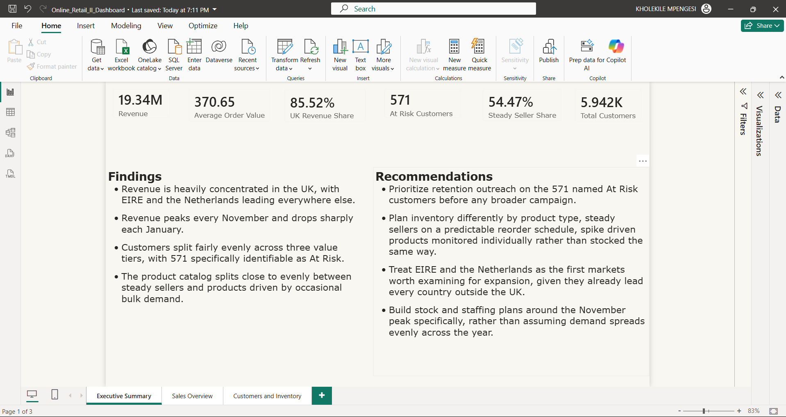
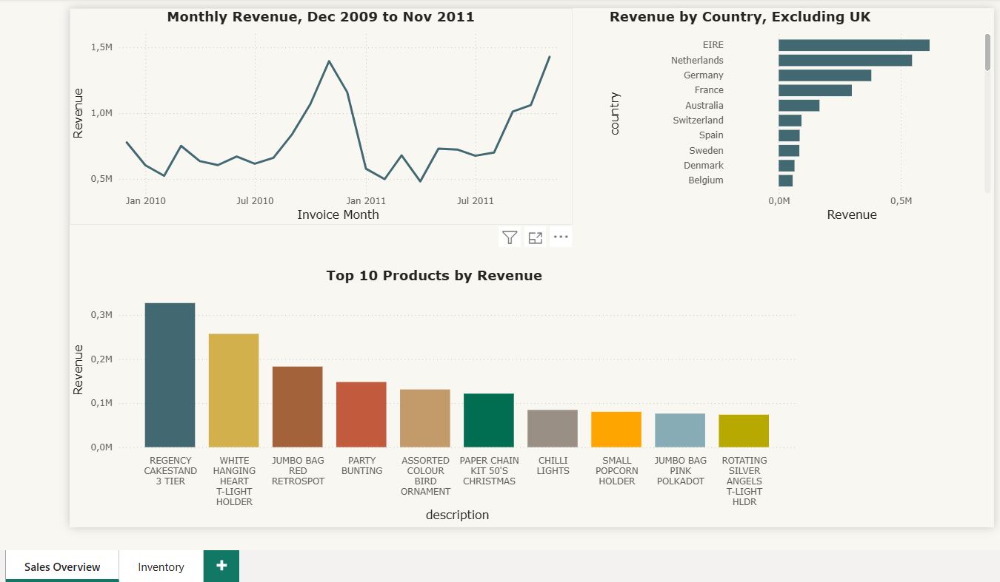
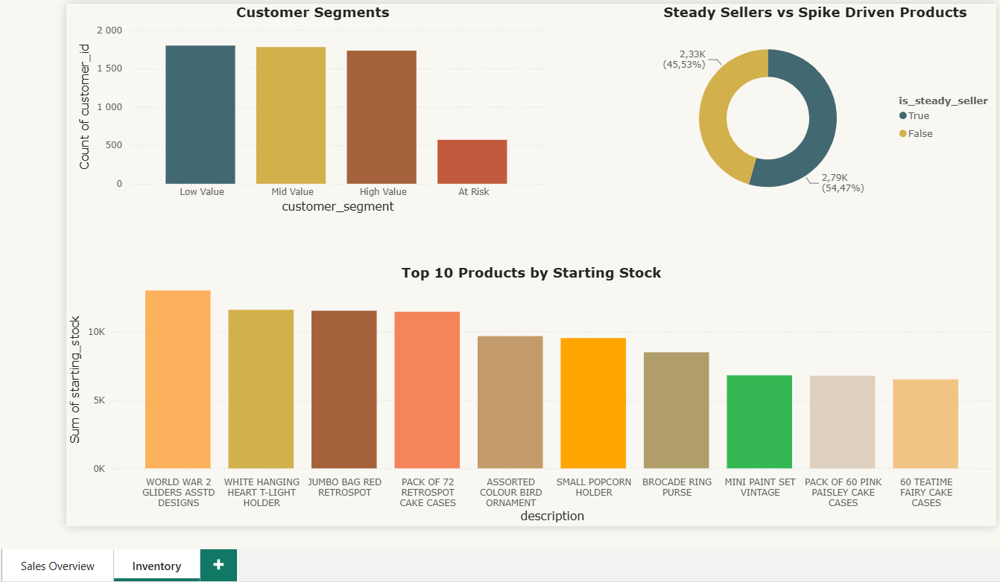

# Online Retail II Project

## Project Background

Online Retail II is a real transaction log from a UK based online retailer selling gift and homeware items, covering December 2009 through December 2011, with many of its customers being wholesalers rather than individual shoppers. The data arrives genuinely messy, mixed data types, inconsistent product descriptions, missing customer identifiers, and a number of stock codes that turn out to be fees and adjustments rather than real products.

This project treats that raw data the way an actual retail analytics function would, cleaning and structuring it properly, then using it to answer specific business questions rather than working through techniques for their own sake.

Insights and recommendations are provided across the following areas:

* **Revenue and Seasonality**: how revenue moves month to month and where it's concentrated
* **Product Performance**: which products actually drive revenue
* **Customer Segmentation**: grouping customers by recency, frequency and monetary value
* **Inventory Planning**: estimating stock needs from real demand patterns rather than a guess

The interactive Power BI dashboard can be downloaded [here](Report/Online_Retail_II_Dashboard.pbix).

The SQL used to build the database structure can be found [here](Engineered%20tables).

The full set of analytical queries can be found [here](SQL%20Queries).

The complete written report, with the reasoning behind every decision, can be found [here](Report).

## Executive Summary

Revenue across the two year period totals 19.3 million, generated from just over one million order lines once cancellations, fees and adjustments are excluded. Revenue is heavily concentrated in the UK, at roughly 85 percent of the total, and follows a clear seasonal pattern, peaking every November before dropping sharply each January. Customers split fairly evenly across three value tiers, with 571 specifically identifiable as At Risk. The product catalog splits close to evenly too, just over half the products sell steadily enough to trust their average demand, the rest show irregular, spike driven demand instead, a distinction that shaped how stock estimates were calculated.

## Revenue and Seasonality

**Revenue peaks every November**, reaching 1.4 million in both 2010 and 2011, before dropping sharply into January each year, a normal pattern for a gift retailer once the holiday period ends rather than a sign of instability.

**The United Kingdom accounts for roughly 85 percent of all revenue.** Outside the UK, EIRE leads all other countries at 618,181.89, followed by the Netherlands at 546,273.03 and Germany at 379,342.24. The UK itself is left out of the country comparison chart on purpose, since including it would make every other country invisible next to it.

## Product Performance

**Regency Cakestand 3 Tier is the single best selling product**, at 327,345.20, ahead of White Hanging Heart T Light Holder at 257,371.21 and Jumbo Bag Red Retrospot at 183,071.46. Christmas and gift specific items fill out most of the remaining top ten, consistent with the seasonal pattern above.

**About 1,125 of 5,113 products earn above the average product's revenue**, a little over one in five, confirming a fairly typical retail shape, a smaller group of products doing most of the work, a longer tail doing less.

## Customer Segmentation

Customers were scored on recency, frequency and monetary value, then grouped into four segments.

| Segment | Customers |
|---|---|
| Low Value | 1,797 |
| Mid Value | 1,778 |
| High Value | 1,731 |
| At Risk | 571 |

**The At Risk group is a specific, named list of 571 customers**, people who haven't bought recently, buy rarely, or spend little, rather than a vague idea of churn, turning "focus on retention" into something someone could actually act on.

## Inventory Planning

The dataset never records actual stock levels, so starting stock was estimated from each product's own demand history rather than assumed.

**54.47 percent of products sell steadily enough across the two years to count as reliable**, and were given a starting stock based on three months of their average demand. **The remaining 45.53 percent show irregular, spike driven demand instead**, and were given a more conservative figure based on their full demand spread across the whole period, so a single unusual bulk order couldn't be mistaken for a normal pattern.

## Recommendations

* Prioritize retention outreach on the 571 named At Risk customers before any broader campaign
* Plan inventory differently by product type, steady sellers on a predictable reorder schedule, spike driven products monitored individually rather than stocked the same way
* Treat EIRE and the Netherlands as the first markets worth examining for expansion, given they already lead every country outside the UK
* Build stock and staffing plans around the November peak specifically, rather than assuming demand spreads evenly across the year

## What's in this folder

**online_retail_ll**: the original, unedited dataset as downloaded from the UCI Machine Learning Repository.

**Online_Retail_Analysis**: the Power BI file used for cleaning, where the raw data was profiled, typed correctly, filtered, and flagged before it ever reached a database.

**Engineered tables**: the SQL used to create the database structure itself, customers, products, orders, and inventory_snapshot, including the primary keys and foreign key relationships linking them together.

**SQL Queries**: every analytical query run against the finished database.

**Graphs**: the chart images referenced above.

**Report**: the full written report, and the finished Power BI dashboard file.

## A note on honesty

Every decision in this project, what to exclude, how to fill a gap, which threshold to use, is documented with the reasoning behind it in the full report, not just the outcome. This was built as if a retail analytics or planning team needed it, not because one actually did. No business acted on these findings, and none of the numbers here reflect a real company's performance. inventory_snapshot in particular is a synthetic table, not real inventory data, and is described as such throughout rather than presented as something it isn't.
