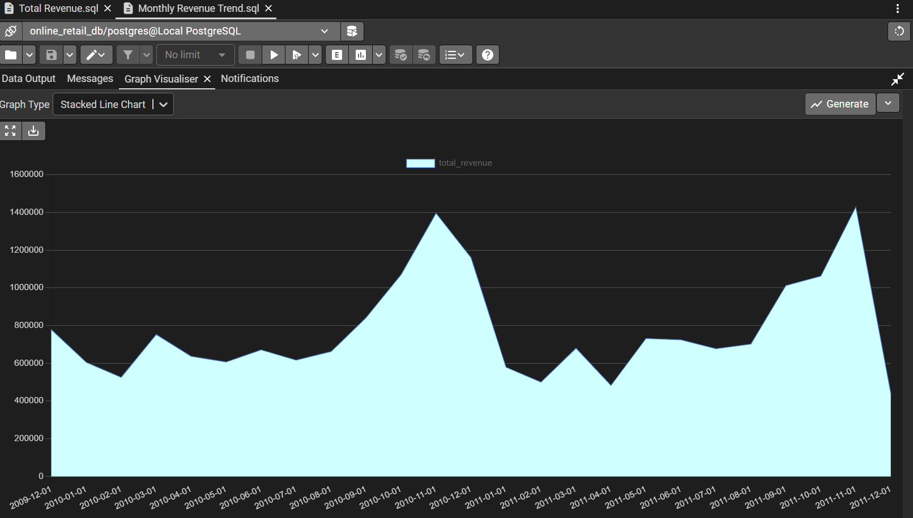
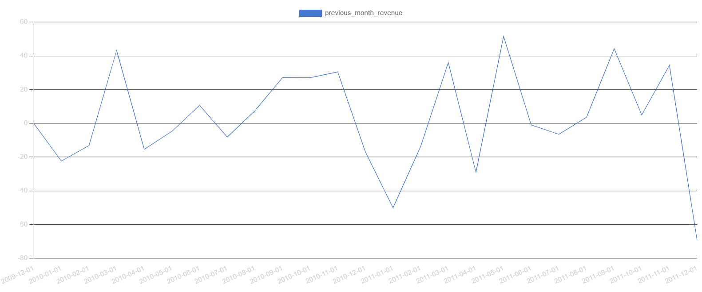

# Online Retail II Project

This project takes a real, messy two year retail dataset and turns it into a working relational database and a Power BI dashboard, with every decision along the way reasoned through rather than just executed. It follows the path an actual analytics project would take, cleaning and profiling raw data in Power Query, designing and building a normalized database in PostgreSQL, writing analytical SQL against it, including window functions, CTEs, and a subquery, and finishing with a two page dashboard connected directly to that database.

The full reasoning behind every decision sits in the accompanying report. This README pulls out what's worth knowing at a glance, what the data looked like going in, what needed fixing and why, how the database is structured, and what the analysis actually found.

## The dataset

Online Retail II, from the UCI Machine Learning Repository. Real transactions from a UK based online retailer selling gift and homeware items, covering December 2009 through December 2011, with many of its customers being wholesalers rather than individual shoppers. It arrives as two Excel sheets, one per year, 525,461 rows in the first and 541,910 in the second, and it's known to be genuinely messy rather than cleaned up for teaching.

## Cleaning the data

Before any of the numbers could be trusted, the raw data needed real work. A few things that came up:

* Invoice and StockCode both mixed numbers and text. Cancelled orders carry an invoice number starting with C, and a handful of stock codes aren't products at all.
* A systematic check across the whole StockCode column turned up sixteen codes that aren't real products, POST, DOT, BANK CHARGES, AMAZONFEE, M, D, B, ADJUST, S, GIFT, CRUK, PADS, DCGSSGIRL, DCGSSBOY, DCGSLBOY, and DCGSLGIRL, along with two clearly labeled test rows found later, TEST001 and TEST002. All of these were flagged rather than deleted, so revenue could still be reconciled with fees included if that was ever needed.
* CustomerID was missing in about 21 percent of rows in the first year and 25 percent in the second. Left as a true null rather than filled with a placeholder, alongside a separate flag marking whether a customer was identified at all.
* 6,865 and 5,268 exact duplicate rows were found and removed across the two sheets.
* 388 products, out of roughly 5,100, had never once been given a real description in either year.
* Country turned out to sit at the transaction level rather than the customer level. Thirteen customers were linked to two different real countries each, plausible given how many customers are wholesalers.

Each of these came with a documented decision, not just a fix, and the full reasoning behind each one is in the report.

## Database design

The cleaned data was split into four tables in PostgreSQL, following a star schema, one fact table and three dimension tables, rather than kept as a single flat file.

| Table | Rows | Role |
|---|---|---|
| customers | 5,942 | Dimension |
| products | 5,131 | Dimension |
| orders | 1,055,238 | Fact table |
| inventory_snapshot | 5,113 | Dimension, synthetic |

customers holds each customer's first and last purchase date and total order count. products holds a cleaned, single description per stock code, resolved from as many as ten different recorded descriptions for the same product over time. orders is the fact table, referencing both by key, holding quantity, price, invoice date, country, and flags marking cancellations, real product codes, and identified customers.

inventory_snapshot doesn't come from the source data at all, since the dataset never records actual stock levels. It was built from the products' own demand history, giving steady sellers a starting stock based on three months of average demand, and giving products with irregular, spike driven demand a more conservative figure based on their full demand spread across the whole period instead, so a single unusual bulk order couldn't be mistaken for a normal pattern.

## The SQL analysis

With the database built, the analysis covered:

* Total revenue, 19,343,834.21, calculated across every row flagged as a real product
* Monthly revenue trend, showing a clear seasonal peak each November
* Top products by revenue, calculated two ways, a standard aggregation and again using RANK as a window function, to confirm both methods agree
* A subquery identifying which products earn above the average, about 1,125 of 5,113 products, a little over one in five
* Month over month revenue growth using LAG, and a running total using SUM as a window function
* A full RFM customer segmentation, recency, frequency, and monetary value, scored into quartiles and grouped into four segments

| Segment | Customers |
|---|---|
| Low Value | 1,797 |
| Mid Value | 1,778 |
| High Value | 1,731 |
| At Risk | 571 |

* Revenue by country, showing the United Kingdom accounts for roughly 85 percent of all revenue, with EIRE and the Netherlands leading the rest by a clear margin
* Average monthly demand per product, checked closely enough to catch a product whose apparent demand was driven almost entirely by a single bulk order rather than steady sales, which directly shaped how inventory_snapshot was built

## The Power BI dashboard

Power BI connects directly to the PostgreSQL database rather than a static export, so every number below reflects the same tables and logic used throughout the SQL work. The dashboard is split across two pages.

**Sales Overview**

* Monthly revenue climbs every year toward November, peaking at 1.4 million in November 2010 and again in November 2011, then drops sharply into the new year each time, a normal pattern for a gift retailer once the holiday period ends.
* Outside the UK, EIRE leads all other countries at 618,181.89, followed by the Netherlands at 546,273.03 and Germany at 379,342.24. The UK itself is left out of this particular chart on purpose, since it accounts for roughly 85 percent of all revenue on its own, and including it would make every other country invisible next to it.
* Regency Cakestand 3 Tier is the single best selling product at 327,345.20, ahead of White Hanging Heart T Light Holder at 257,371.21 and Jumbo Bag Red Retrospot at 183,071.46. Christmas and gift specific items, Paper Chain Kit 50's Christmas and Party Bunting among them, fill out the rest of the top ten.

**Customers and Inventory**

* Customers split fairly evenly across three tiers, 1,797 Low Value, 1,778 Mid Value, and 1,731 High Value, alongside a smaller, more specific group of 571 customers flagged At Risk, people who haven't bought recently, buy rarely, or spend little.
* The product catalog splits close to evenly too, 54.47 percent of products sell steadily enough across the two years to count as reliable, while 45.53 percent show irregular, spike driven demand instead, close enough to an even split that the two different inventory calculations behind this project were genuinely necessary, not just a precaution for a handful of odd products.
* The products needing the largest estimated starting stock are mostly high volume, low cost items. World War 2 Gliders Asstd Designs sits highest at an estimated 13,000 units, with White Hanging Heart T Light Holder and Jumbo Bag Red Retrospot close behind, both products that also appear in the top ten by revenue above.

Two supporting charts pulled directly from the SQL tool during analysis, kept exactly as they came out rather than redrawn afterward:

* The same seasonal pattern as above, shown here across the full raw output before any month was filtered out, including the sharp drop at the very end. That final drop, December 2011, isn't a real decline, the dataset only covers nine days of that month.

* Rather than raw totals, this tracks percentage change from one month to the next. The steepest genuine drop is January 2011, down just over 50 percent immediately after the November and December peak. The strongest single month of growth is May 2011, up nearly 52 percent. The final point, a drop of about 69 percent in December 2011, is the same partial month effect described above, not a real collapse in sales.

## What's in this folder

**online_retail_ll**: the original, unedited dataset as downloaded from the UCI Machine Learning Repository.

**Online_Retail_Analysis**: the Power BI file used for cleaning, where the raw data was profiled, typed correctly, filtered, and flagged before it ever reached a database.

**Engineered tables**: the SQL used to create the database structure itself, customers, products, orders, and inventory_snapshot, including the primary keys and foreign key relationships linking them together.

**SQL Queries**: every analytical query run against the finished database.

**Graphs**: the chart images referenced above.

**Report**: the full written report, and the finished Power BI dashboard file.

## A note on honesty

Every decision in this project, what to exclude, how to fill a gap, which threshold to use, is documented with the reasoning behind it in the full report, not just the outcome. Where a number looked wrong at first, like a one row mismatch during import or an inflated demand figure driven by a single bulk order, it was investigated and resolved with evidence rather than assumed away. inventory_snapshot in particular is a synthetic table, not real inventory data, and is described as such throughout rather than presented as something it isn't.
